<br/>
<p align="center">
  <a href="https://hermes-agent.nousresearch.com/docs/"></a>
  <a href="https://t.me/hermes_agent_desktop"></a>
  <a href="https://github.com/fathah/hermes-desktop/blob/main/LICENSE"></a>
  <a href="https://hermesagents.cc/"></a>
<a href="https://github.com/fathah/hermes-desktop/stargazers">
  
</a>
  <a href="https://github.com/fathah/hermes-desktop/releases/">
  
</a>
</p>

> **This project is in active development.** Features may change, and some things might break. If you run into a problem or have an idea, [open an issue](https://github.com/fathah/hermes-desktop/issues). Contributions are welcome!

## Languages

- English: `README.md`
- 简体中文: `README.zh-CN.md`
- 日本語: `README.ja-JP.md`

Hermes Desktop is a native desktop app for installing, configuring, and chatting with [Hermes Agent](https://github.com/xzly111/qiqiclaw) — a self-improving AI assistant with tool use, multi-platform messaging, and a closed learning loop.

Instead of managing the CLI by hand, the app walks through install, provider setup, and day-to-day usage in one place. It uses the official Hermes install script, stores Hermes in `~/.hermes`, and gives you a GUI for chat, sessions, profiles, memory, skills, tools, scheduling, messaging gateways, and more.

## Install

<a href="https://hermesagents.cc/">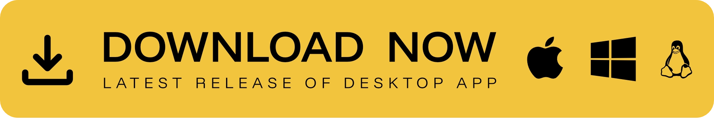</a>

### Windows

> **Windows users:** The installer is not code-signed. Windows SmartScreen will warn on first launch — click "More info" → "Run anyway".

> **WSL users:** If the installer stalls at `Switching to root user to install dependencies...`, Playwright is waiting for a sudo password that has no TTY to read from. Grant passwordless sudo for the install, then revert when finished:
>
> ```bash
> echo "$USER ALL=(ALL) NOPASSWD: ALL" | sudo tee /etc/sudoers.d/hermes-install
> # …re-run the installer; once it finishes:
> sudo rm /etc/sudoers.d/hermes-install
> ```
>
> Tracked in [#109](https://github.com/fathah/hermes-desktop/issues/109).

### Fedora (RPM)

```bash
sudo dnf install ./hermes-desktop-<version>.rpm
```

> **Fedora users:** The `.rpm` is not GPG-signed. If your system enforces signature checking, append `--nogpgcheck` to the install command. Auto-update is not supported for `.rpm` builds (limitation of `electron-updater`); reinstall the new `.rpm` to update.

## Preview

<table>
<tr>
<td width="50%" align="center"><b>Chat</b><br/>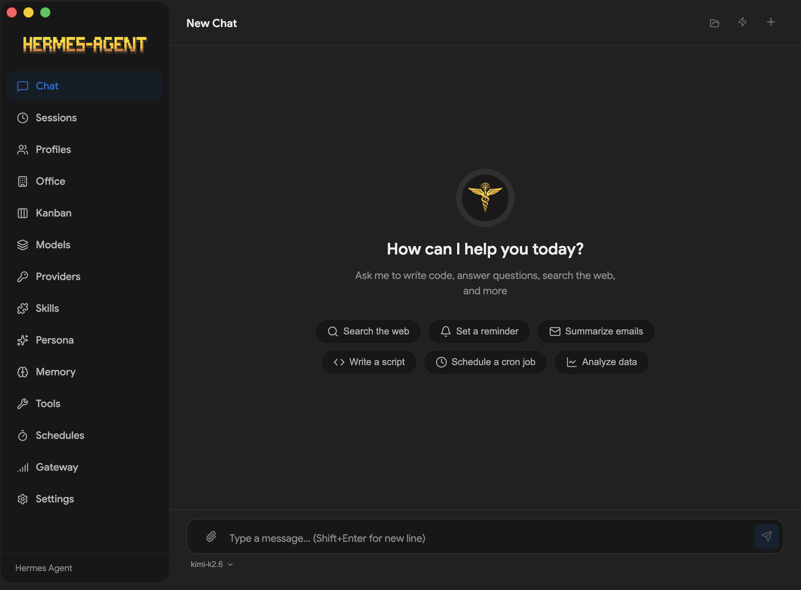</td>
<td width="50%" align="center"><b>Profiles</b><br/>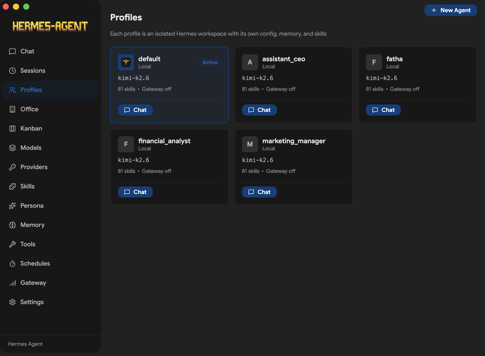</td>
</tr>
<tr>
<td width="50%" align="center"><b>Models</b><br/>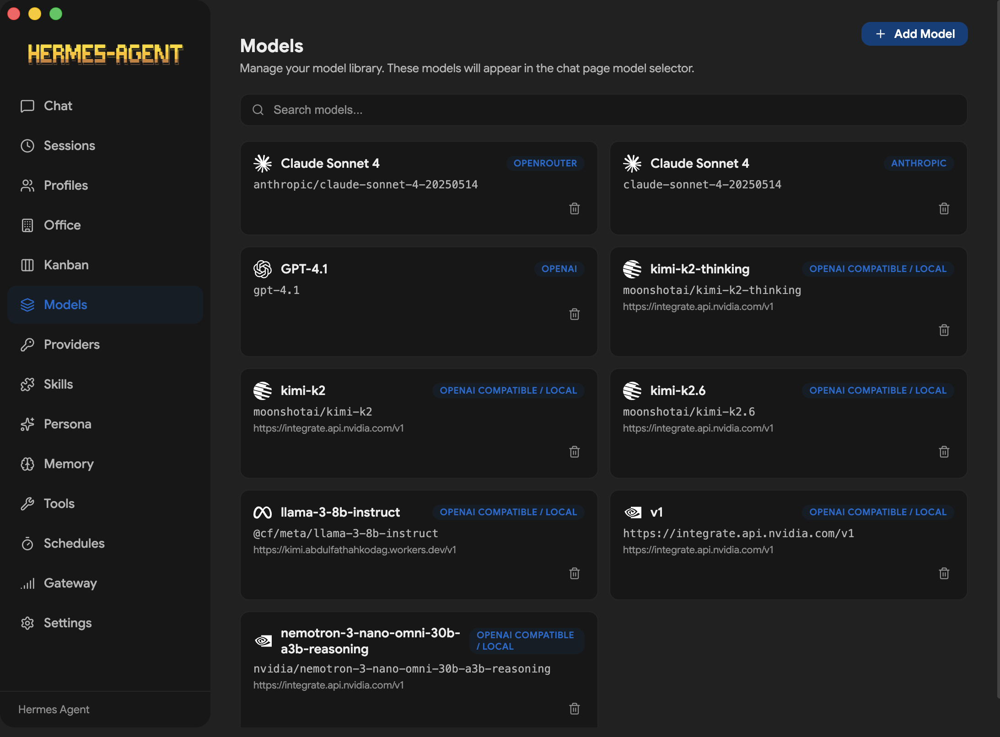</td>
<td width="50%" align="center"><b>Providers</b><br/>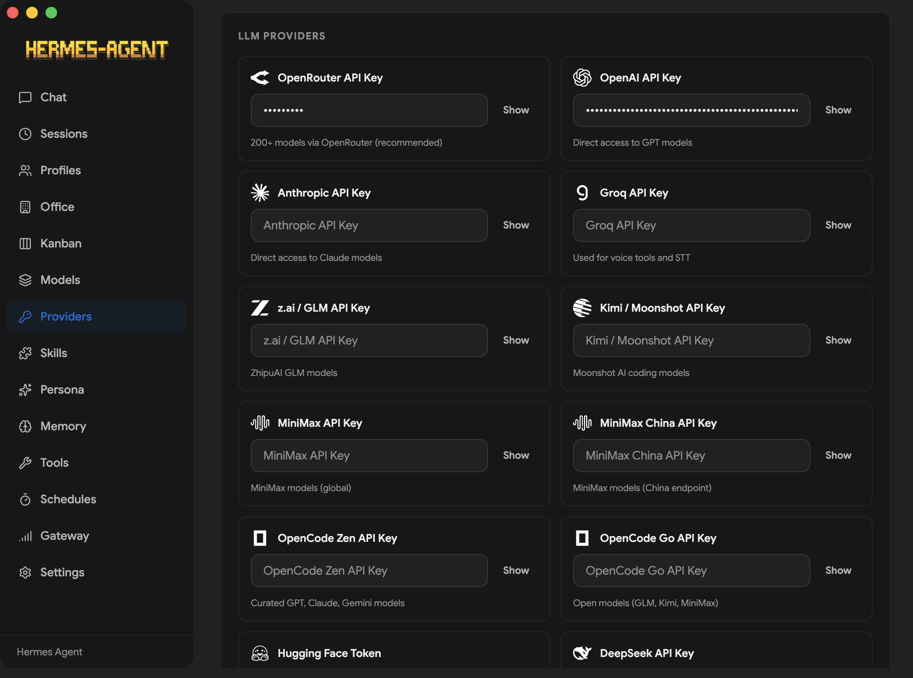</td>
</tr>
<tr>
<td width="50%" align="center"><b>Tools</b><br/>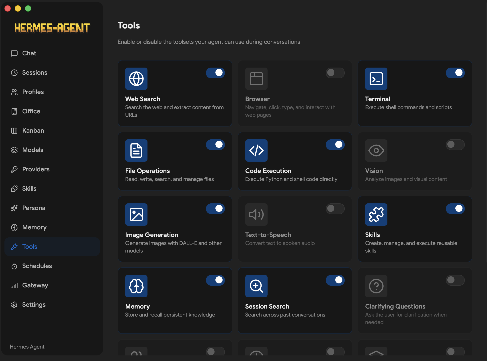</td>
<td width="50%" align="center"><b>Skills</b><br/>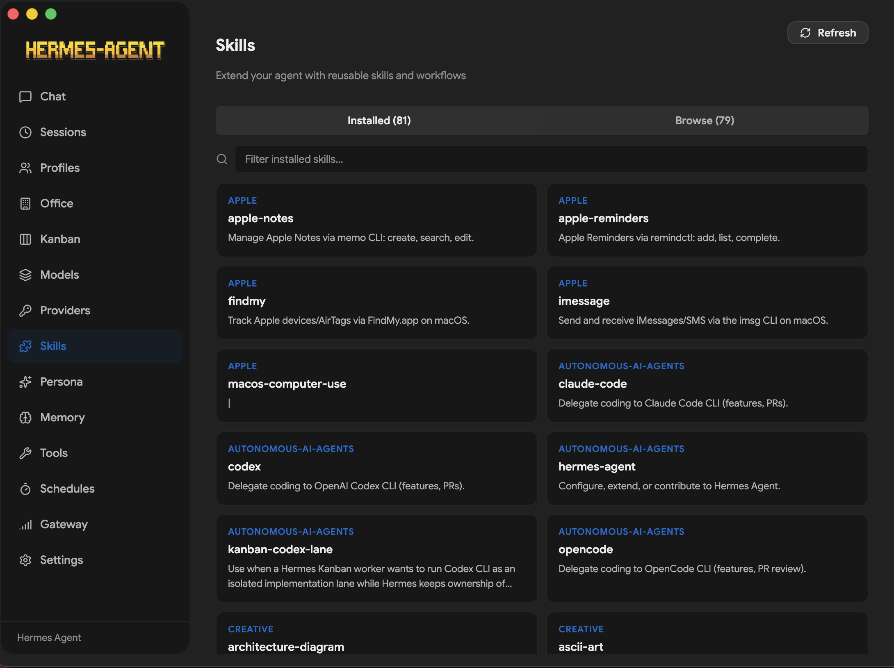</td>
</tr>
<tr>
<td width="50%" align="center"><b>Schedules</b><br/></td>
<td width="50%" align="center"><b>Gateway</b><br/></td>
</tr>
<tr>
<td width="50%" align="center"><b>Persona</b><br/>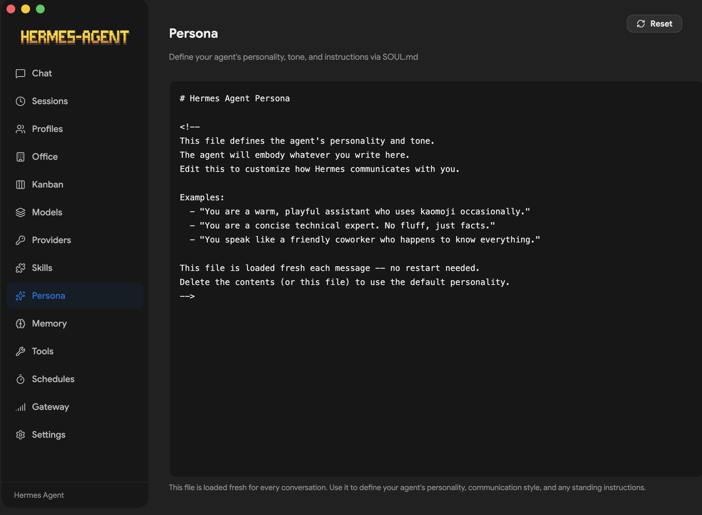</td>
<td width="50%" align="center"><b>Kanban</b><br/>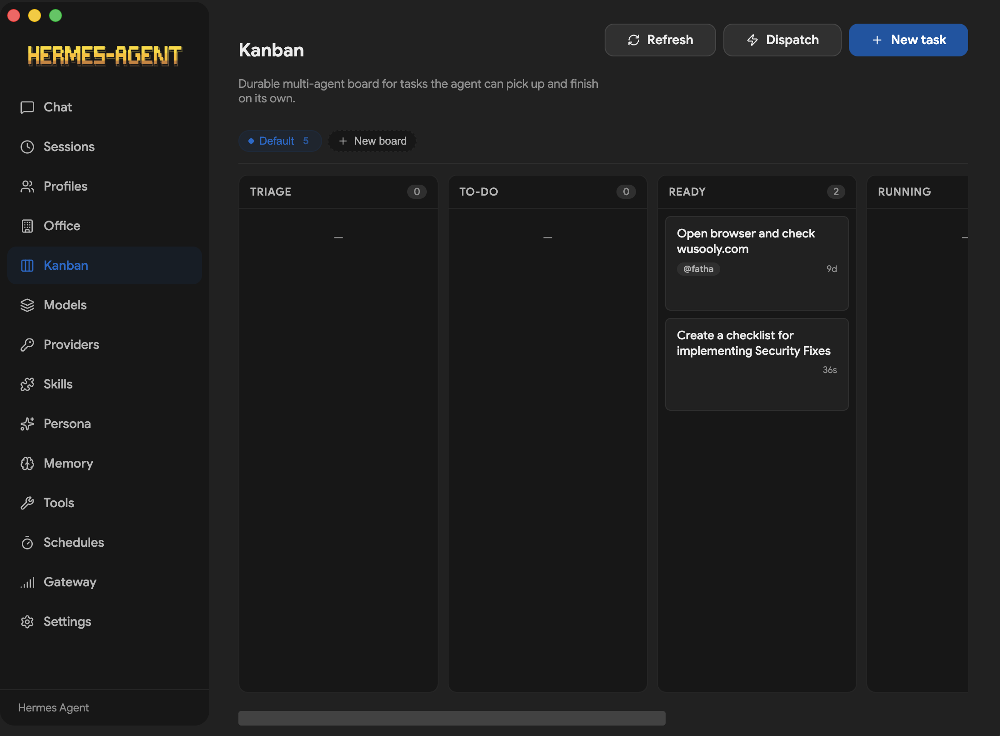</td>
</tr>
<tr>
<td width="50%" align="center"><b>Office</b><br/>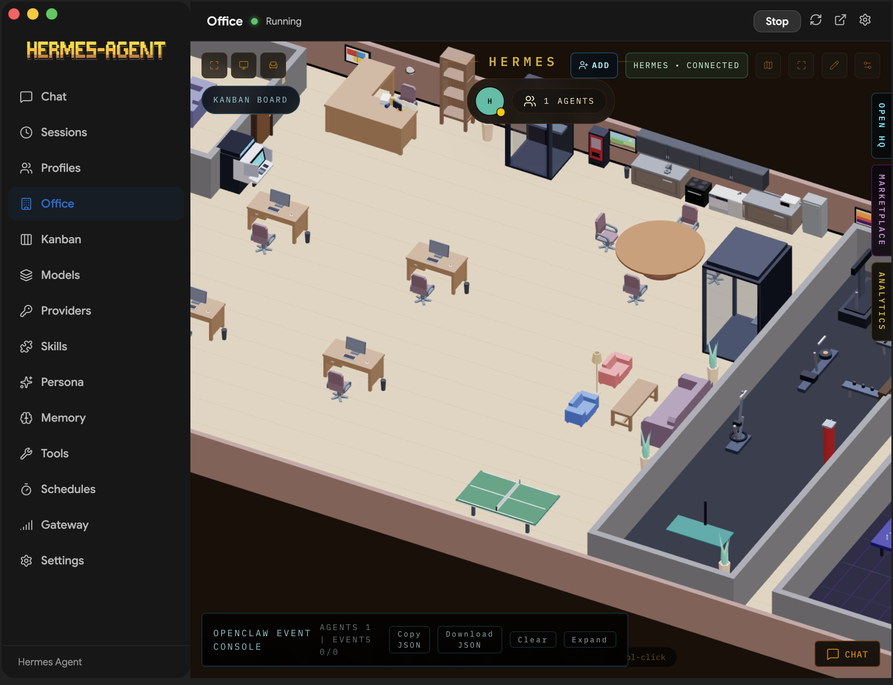</td>
<td width="50%" align="center"><b>Settings</b><br/>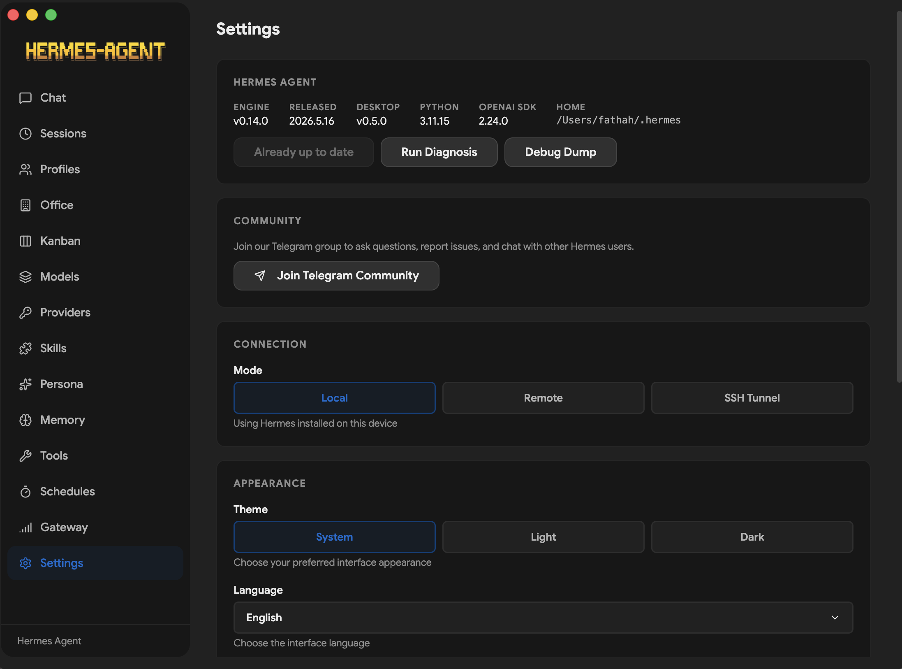</td>
</tr>
</table>

## Features

- **Guided first-run install** for Hermes Agent with progress tracking and dependency resolution
- **Local or remote backend** — run Hermes locally on `127.0.0.1:8642`, or connect the desktop app to a remote Hermes API server with URL + API key
- **Multi-provider support** — OpenRouter, Anthropic, OpenAI, Google (Gemini), xAI (Grok), Nous Portal, Qwen, MiniMax, Hugging Face, Groq, and local OpenAI-compatible endpoints (LM Studio, Atomic Chat, Ollama, vLLM, llama.cpp)
- **Streaming chat UI** with SSE streaming, tool progress indicators, markdown rendering, and syntax highlighting
- **Token usage tracking** — live prompt/completion token counts and cost display in the chat footer, plus a `/usage` slash command
- **22 slash commands** — `/new`, `/clear`, `/fast`, `/web`, `/image`, `/browse`, `/code`, `/shell`, `/usage`, `/help`, `/tools`, `/skills`, `/model`, `/memory`, `/persona`, `/version`, `/compact`, `/compress`, `/undo`, `/retry`, `/debug`, `/status`, and more
- **Session management** — full-text search (SQLite FTS5), date-grouped history, resume and search across conversations
- **Profile switching** — create, delete, and switch between separate Hermes environments with isolated config
- **14 toolsets** — web, browser, terminal, file, code execution, vision, image gen, TTS, skills, memory, session search, clarify, delegation, MoA, and task planning
- **Memory system** — view/edit memory entries, user profile memory, capacity tracking, and discoverable memory providers (Honcho, Hindsight, Mem0, RetainDB, Supermemory, ByteRover)
- **Persona editor** — edit and reset your agent's SOUL.md personality
- **Saved models** — CRUD management for model configurations across providers
- **Scheduled tasks** — cron job builder (minutes, hourly, daily, weekly, custom cron) with 15 delivery targets
- **16 messaging gateways** — Telegram, Discord, Slack, WhatsApp, Signal, Matrix, Mattermost, Email (IMAP/SMTP), SMS (Twilio/Vonage), iMessage (BlueBubbles), DingTalk, Feishu/Lark, WeCom, WeChat (iLink Bot), Webhooks, Home Assistant
- **Hermes Office (Claw3d)** — visual 3D interface with dev server and adapter management
- **Backup, import & debug dump** — full data backup/restore and system diagnostics from Settings
- **Log viewer** — view gateway and agent logs directly from the Settings screen
- **Auto-updater** — check for and install updates via electron-updater
- **i18n ready** — internationalization framework with English locale covering all screens, ready for community translations
- **Test suite** — SSE parser, IPC handlers, preload API surface, installer utilities, and constants validation with Vitest

## How It Works

On first launch, the app:

1. Asks whether you want to run Hermes **locally** or connect to a **remote** Hermes API server.
2. **Local mode:** checks whether Hermes is already installed in `~/.hermes`; if not, runs the official Hermes installer with dependency resolution (Git, uv, Python 3.11+).
3. **Remote mode:** prompts for the remote API URL and API key, validates the connection, and skips local install.
4. Prompts for an API provider or local model endpoint.
5. Saves provider config and API keys through Hermes config files.
6. Launches the main workspace once setup is complete.

In local mode, chat requests go through `http://127.0.0.1:8642` with SSE streaming. In remote mode, the app talks to your configured remote URL with the same streaming protocol. The desktop app parses the stream in real time, rendering tool progress, markdown content, and token usage as it arrives.

## Screens

| Screen        | Description                                                                           |
| ------------- | ------------------------------------------------------------------------------------- |
| **Chat**      | Streaming conversation UI with slash commands, tool progress, and token tracking      |
| **Sessions**  | Browse, search, and resume past conversations                                         |
| **Agents**    | Create, delete, and switch between Hermes profiles                                    |
| **Skills**    | Browse, install, and manage bundled and installed skills                              |
| **Models**    | Manage saved model configurations per provider                                        |
| **Memory**    | View/edit memory entries, user profile, and configure memory providers                |
| **Soul**      | Edit the active profile's persona (SOUL.md)                                           |
| **Tools**     | Enable or disable individual toolsets                                                 |
| **Schedules** | Create and manage cron jobs with delivery targets                                     |
| **Gateway**   | Configure and control messaging platform integrations                                 |
| **Office**    | Claw3d visual interface setup and management                                          |
| **Settings**  | Provider config, credential pools, backup/import, log viewer, network settings, theme |

## Supported Providers

### LLM Providers

| Provider            | Notes                                    |
| ------------------- | ---------------------------------------- |
| **OpenRouter**      | 200+ models via single API (recommended) |
| **Anthropic**       | Direct Claude access                     |
| **OpenAI**          | Direct GPT access                        |
| **Google (Gemini)** | Google AI Studio                         |
| **xAI (Grok)**      | Grok models                              |
| **Nous Portal**     | Free tier available                      |
| **Qwen**            | QwenAI models                            |
| **MiniMax**         | Global and China endpoints               |
| **Hugging Face**    | 20+ open models via HF Inference         |
| **Groq**            | Fast inference (voice/STT)               |
| **Local/Custom**    | Any OpenAI-compatible endpoint           |

Local presets are included for LM Studio, Atomic Chat, Ollama, vLLM, and llama.cpp.

### Messaging Platforms

Telegram, Discord, Slack, WhatsApp, Signal, Matrix/Element, Mattermost, Email (IMAP/SMTP), SMS (Twilio & Vonage), iMessage (BlueBubbles), DingTalk, Feishu/Lark, WeCom, WeChat (iLink Bot), Webhooks, and Home Assistant.

### Tool Integrations

Exa Search, Parallel API, Tavily, Firecrawl, FAL.ai (image generation), Honcho, Browserbase, Weights & Biases, and Tinker.

## Development

### Prerequisites

- Node.js and npm
- A Unix-like shell environment for the Hermes installer
- Network access for downloading Hermes during first-run install

### Install dependencies

```bash
npm install
```

### Start the app in development

```bash
npm run dev
```

### Run checks

```bash
npm run lint
npm run typecheck
```

### Run tests

```bash
npm run test
npm run test:watch
```

### Build the desktop app

```bash
npm run build
```

Platform packaging:

```bash
npm run build:mac
npm run build:win
npm run build:linux
npm run build:rpm    # Fedora/RHEL .rpm only
```

## First-Time Setup

When the app opens for the first time, it will either detect an existing Hermes installation or offer to install it for you.

Supported setup paths in the UI:

- `OpenRouter`
- `Anthropic`
- `OpenAI`
- `Local LLM` via an OpenAI-compatible base URL

Local presets are included for:

- LM Studio
- Atomic Chat
- Ollama
- vLLM
- llama.cpp

Hermes files are managed in:

- `~/.hermes`
- `~/.hermes/.env`
- `~/.hermes/config.yaml`
- `~/.hermes/hermes-agent`
- `~/.hermes/profiles/` — named profile directories
- `~/.hermes/state.db` — session history database
- `~/.hermes/cron/jobs.json` — scheduled tasks

## Tech Stack

- **Electron** 39 — cross-platform desktop shell
- **React** 19 — UI framework
- **TypeScript** 5.9 — type safety across main and renderer processes
- **Tailwind CSS** 4 — utility-first styling
- **Vite** 7 + electron-vite — fast dev server and build tooling
- **better-sqlite3** — local session storage with FTS5 full-text search
- **i18next** — internationalization framework
- **Vitest** — test runner

## Notes

- The desktop app depends on the upstream Hermes Agent project for agent behavior and tool execution.
- The built-in installer runs the official Hermes install script with `--skip-setup`, then completes provider configuration in the GUI.
- Local model providers do not require an API key, but the compatible server must already be running.
- Alternative npm registry routes are supported for environments with restricted network access.

## Contributing

Contributions are welcome! Check out the [Contributing Guide](CONTRIBUTING.md) to get started. If you're not sure where to begin, take a look at the [open issues](https://github.com/NousResearch/hermes-desktop/issues). Found a bug or have a feature request? [File an issue](https://github.com/NousResearch/hermes-desktop/issues/new).

## Related Project

For the core agent, docs, and CLI workflows, see the main Hermes Agent repository:

- https://github.com/xzly111/qiqiclaw
